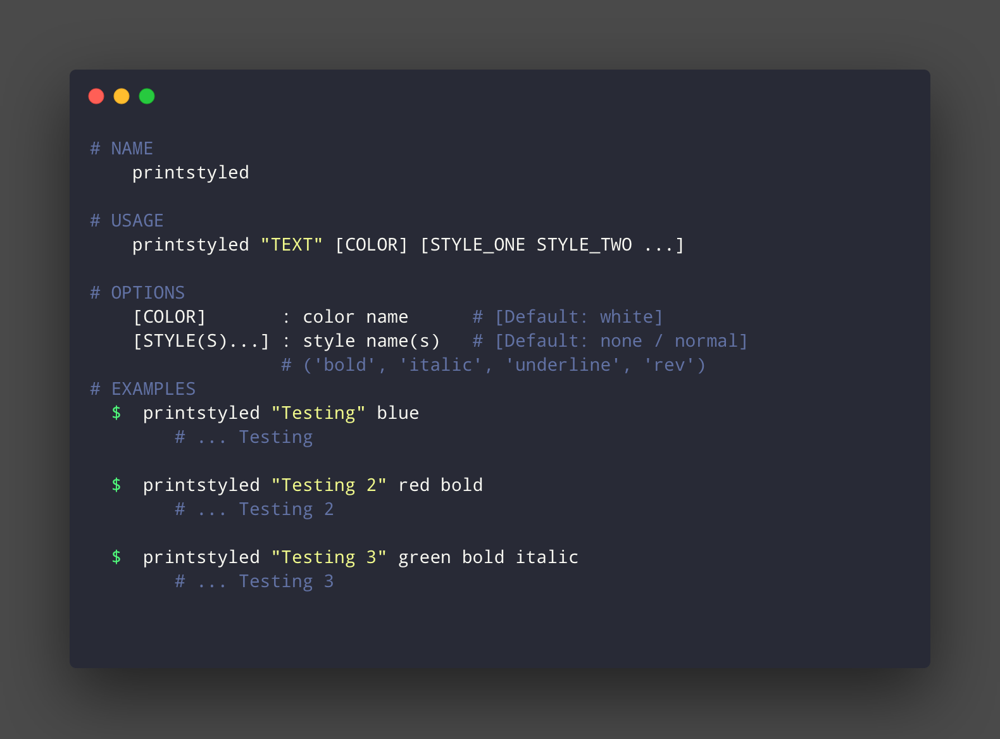

# printstyled [](https://travis-ci.com/mattdanielbrown/printstyled)

> ### CLI tool to intuitively colorize and stylize text in Bash and Javascript Terminals.



*Screenshot of `printstyled`'s Usage Message (in a Dracula-themed terminal)*


## Install

```bash
$ npm install --global printstyled
```


## Usage

```sh

$ printstyled TEXT [COLOR] [STYLE(S)...]

Options
  [COLOR]  		color name 		[Default: white]
  [STYLE(S)]...	style name(s)	[Default: none / normal]
                    Availble Style Values: 'bold', 'italic', 'underline', 'rev'
Examples
  $  printstyled "Testing" blue
         Testing

  $  printstyled "Testing 2" red bold
         Testing 2

  $  printstyled "Testing 3" green bold italic
     Testing 3
```


## API

### `printstyled TEXT [COLOR] [STYLE, STYLE2...]`

**TEXT**	: *The text string to style.*
Type: `String`
> Note: *Required*


**COLOR** : *Name of color to apply.*
Type: `string`
> Default: `white` or default forground color.


**STYLE(S)**: *Styles to apply.*
Type: `string(s)`
> Default: `none` or `normal`


## CLI

```bash
$ printstyled TEXT [COLOR] [STYLE(S)...]
```

```sh
NAME
  printstyled

USAGE
  $ printstyled TEXT [COLOR] [STYLE, STYLE2...]

HELP
  $ printstyled --help

OPTIONS
  COLOR : 'color name'
  # (white | blue | red | green | yellow)	Default: white

  STYLE(S) : 'style name, ...'
  # (bold | italic | underline | rev)		Default: none / normal

EXAMPLES

  $  printstyled "Testing" blue
    # =>  Testing

  $  printstyled "Testing 2" red bold
    # =>  Testing 2

  $  printstyled "Testing 3" green bold italic
    # =>  Testing 3
```
